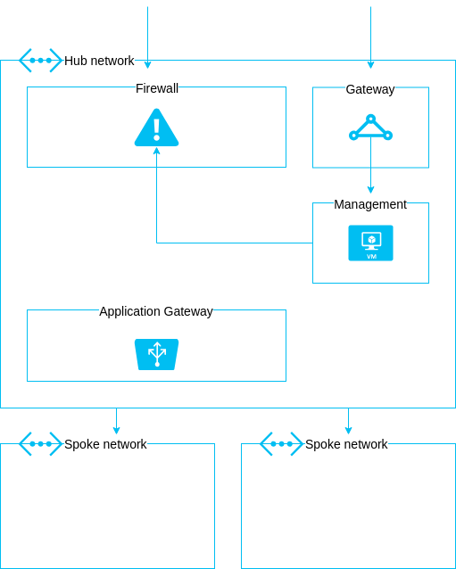

# Hub network

Using [Microsoft recommended Hub-Spoke network topology](https://docs.microsoft.com/en-us/azure/architecture/reference-architectures/hybrid-networking/hub-spoke) this module deployes the hub vnet. Generally there should only be one hub in each region with multiple spokes, where each of them can also be in separate subscriptions. Currently it does not support setting up peering between hub's in different regions, but that could be added as a feature later.

The virtual network will be created with 4 subnets, AzureFirewallSubnet, GatewaySubnet, Management and ApplicationGateway. AzureFirewallSubnet and GatewaySubnet will not contain any UDR (User Defined Route) or NSG (Network Security Group). Management and Application Gateway will route all outgoing traffic through firewall instance.



## Usage

A simple hub network with no additional firewall or nsg rules deployed using [tau](https://github.com/avinor/tau).

```terraform
module {
    source = "avinor/virtual-network-hub/azurerm"
    version = "1.0.0"
}

inputs {
    name = "hub"
    resource_group_name = "networking-hub"
    location = "westeurope"
    address_space = "10.0.0.0/23"
    log_analytics_workspace_id = "log_id"
}
```

For a more complete example with firewall rules and custom nsg rules added to management and application gateway subnet:

```terraform
module {
    source = "avinor/virtual-network-hub/azurerm"
    version = "1.0.0"
}

inputs {
    name = "hub"
    resource_group_name = "networking-hub-rg"
    location = "westeurope"
    address_space = "10.0.0.0/22"
    log_analytics_workspace_id = "log_id"

    mgmt_nsg_rules = [
    {
        name = "allow-ssh"
        direction = "Inbound"
        access = "Allow"
        protocol = "Tcp"
        source_port_range          = "*"
        destination_port_range     = "22"
        source_address_prefix      = "VirtualNetwork"
        destination_address_prefix = "VirtualNetwork"
    },
    ]

    appgw_nsg_rules = [
    {
        name                       = "allow-all-http"
        direction                  = "Inbound"
        access                     = "Allow"
        protocol                   = "Tcp"
        source_port_range          = "*"
        destination_port_range     = "80"
        source_address_prefix      = "VirtualNetwork"
        destination_address_prefix = "*"
    },
    {
        name                       = "allow-all-https"
        direction                  = "Inbound"
        access                     = "Allow"
        protocol                   = "Tcp"
        source_port_range          = "*"
        destination_port_range     = "443"
        source_address_prefix      = "VirtualNetwork"
        destination_address_prefix = "*"
    },
    ]

    firewall_application_rules = [
        {
            name = "microsoft"
            action = "Allow"
            source_addresses = ["10.0.0.0/8"]
            target_fqdns = ["*.microsoft.com"]
            protocol = {
                type = "Http"
                port = "80"
            }
        },
    ]

    firewall_network_rules = [
        {
            name = "ntp"
            action = "Allow"
            source_addresses = ["10.0.0.0/8"]
            destination_ports = ["123"]
            destination_addresses = ["*"]
            protocols = ["UDP"]
        },
    ]

}
```

## DDos protection plan

If `create_ddos_plan` is set it will deploy a [ddos protection plan](https://docs.microsoft.com/en-us/azure/virtual-network/ddos-protection-overview) to offer full protection. Together with Application Gateway WAF activated and threat intelligence in Azure Firewall it will offer full protection.

It uses the premium DDos protection plan that offers more advanced protection, but at a cost. Since only one is required per region that should not increase cost too much.

Coupled together with Azure Application Gateway WAF it provides [full layer 3 to layer 7 mitigation capabilities](https://docs.microsoft.com/en-us/azure/virtual-network/ddos-protection-overview#types-of-ddos-attacks-that-ddos-protection-standard-mitigates).

## Storage account

All flow logs are stored in a storage account creted by hub. Since flow logs do not support using service endpoints at the moment it cannot use network policy to restrict access. This might be implemented later and will be activated when possible.

## Subnets

Creates 4 subnets by default: GatewaySubnet, AzureFirewallSubnet, ApplicationGateway and Management.

| Name       | Description |
|------------|-------------|
| GatewaySubnet   | Should contain VPN Gateway if deployed.
| AzureFirewallSubnet | Deploys an Azure Firewall that will monitor all incoming and outgoing traffic
| ApplicationGateway   | Should contain an Application Gateway if deployed
| Management    | Management subnet for jumphost, accessible from gateway

Both GatewaySubnet and AzureFirewallSubnet allow traffic out and can have public ips. ApplicationGateway and Management subnets route traffic through firewall and does not support public ips due to asymmetric routing.

## Network security groups

By default the network security groups connected to Management and ApplicationGateway will only allow necessary traffic and block everything else (deny-all rule). To add additional NSG rules use the `mgmt_nsg_rules` and `appgw_nsg_rules` variables.

These variables support all properties allowed by `azurerm_network_security_rule` resource. Priority property will be set automatically. It will also set these default values:

```terraform
direction    = "Inbound"
access       = "Allow"
protocol     = "Tcp"
```

## Firewall rules

Input variables `firewall_application_rules`, `firewall_network_rules` and `firewall_nat_rules` can be used to define firewall rules. See variable input object for which parameters are required.
